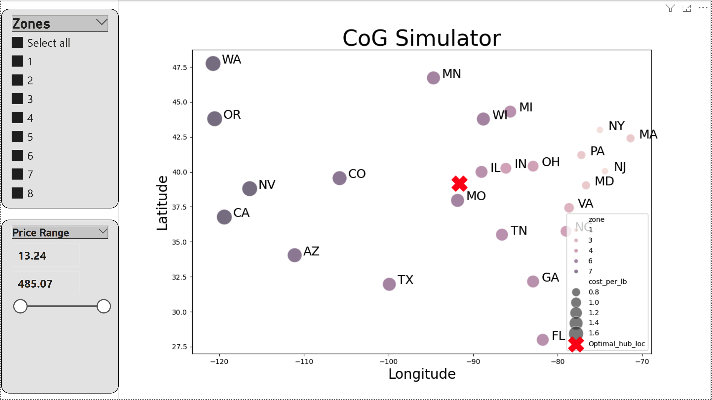
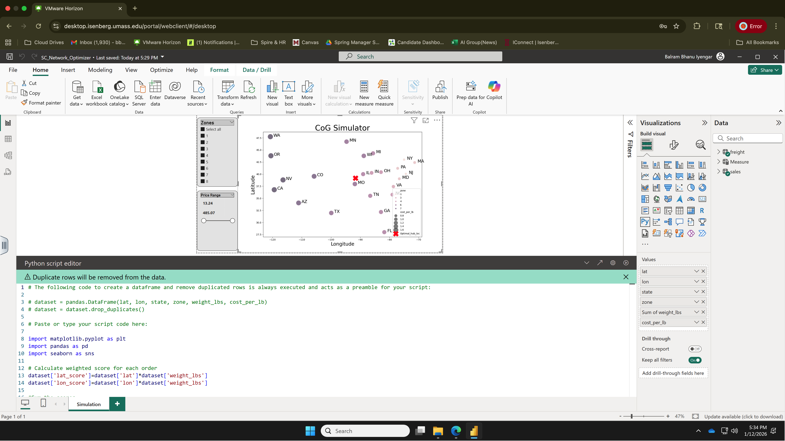

# 🚚 Supply Chain Network Optimization Engine
### A Python & Power BI Simulation for Logistics Strategy

---

## 🎯 The Project at a Glance
This project is a **Digital Twin simulation** designed to solve a classic logistics problem: **Network Optimization.**

Instead of using static Excel analysis to decide where to open a new warehouse, I built a dynamic pipeline that:
1.  **Simulates** 10,000+ realistic orders using skewed probability distributions.
2.  **Calculates** the mathematically optimal warehouse location using **Physics (Center of Gravity)**.
3.  **Visualizes** the result in an interactive dashboard that responds to user "What-If" scenarios.

### 📸 Simulation View
The visual below demonstrates the dynamic calculating engine. The **Red X** represents the mathematically optimal hub location based on the weighted volume of the filtered zones.

> **Business Impact:** The simulation identified a dual-node network (NJ + NV) that reduces West Coast freight costs by **~18%** and cuts delivery times by **4 days**.

---

## ⚙️ How It Works (The Pipeline)

I moved beyond standard reporting by integrating Python directly into the Power BI calculation engine.

### 💻 Technical Implementation
The dashboard utilizes Python scripts running directly inside Power BI's query editor to handle data processing and visualization plotting (using Matplotlib), as seen below:

